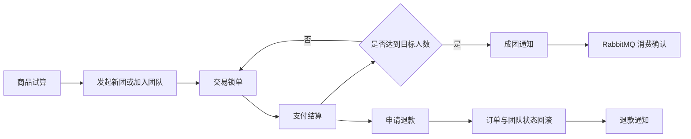

# hjs-group-buy-market-study

一个基于 Java 8、Spring Boot 2.7 和领域驱动设计（DDD）的拼团交易学习项目。项目覆盖商品营销试算、发起拼团、加入拼团、交易锁单、支付结算、成团通知、逆向退款和补偿任务，并提供一套可直接操作真实接口的本地前端实验台。

## 核心能力

- 根据用户、来源、渠道和商品执行拼团活动匹配与优惠试算。
- 支持发起新团或加入已有团队，并通过外部交易号保证锁单幂等。
- 支持支付成功后的订单结算、团队进度推进和成团判断。
- 支持未支付释放、已支付退款和成团后退款等逆向流程。
- 通过 RabbitMQ 发布成团和退款事件，并保留通知任务补偿机制。
- 使用 Redis 实现动态配置、限流配置、分布式锁和业务缓存。
- 使用 MyBatis、MySQL 保存活动、优惠、团队订单和通知任务。
- 提供 Actuator 健康检查、Prometheus 指标和本地全流程前端。

## 技术栈

| 类别 | 技术 |
| --- | --- |
| 运行环境 | Java 8、Maven |
| Web 框架 | Spring Boot 2.7.12 |
| 持久化 | MyBatis 2.1.4、MySQL 8.0 |
| 缓存与协调 | Redis 6.2、Redisson 3.26 |
| 消息队列 | RabbitMQ 3.12 Management |
| 可观测性 | Spring Boot Actuator、Prometheus |
| 本地前端 | HTML、CSS、原生 JavaScript |
| 部署编排 | Docker Desktop、Docker Compose |

## 业务流程



## 工程结构

```text
grouph-buy-market-study
├── group-buy-market-api                   # 对外服务接口、请求响应 DTO
├── grouph-buy-market-study-app            # Spring Boot 启动、配置、Mapper XML
├── grouph-buy-market-study-domain         # 活动、交易、结算、退款领域逻辑
├── grouph-buy-market-study-infrastructure # 仓储、DAO、Redis、MQ 和网关实现
├── grouph-buy-market-study-trigger        # HTTP、定时任务、消息监听器
├── grouph-buy-market-study-types          # 通用枚举、异常和基础类型
└── docs
    ├── changes                            # 每次项目改动记录
    ├── dev-ops                            # Docker Compose、SQL 和中间件配置
    ├── documents                          # 设计与学习文档
    └── ui/group-buy-flow                  # 拼团全流程前端
```

模块依赖遵循“触发器调用领域服务、领域层依赖抽象、基础设施实现抽象”的方向，HTTP DTO 与领域实体保持隔离。

## 本地端口与账号

Docker Compose 中的服务只绑定本机回环地址。

| 服务 | 地址 | 账号 | 密码 |
| --- | --- | --- | --- |
| Spring Boot | `http://127.0.0.1:8091` | - | - |
| MySQL | `127.0.0.1:13306` | `root` | `123456` |
| Redis | `127.0.0.1:16379` | - | 无密码 |
| RabbitMQ AMQP | `127.0.0.1:5672` | `admin` | `admin` |
| RabbitMQ 管理台 | `http://127.0.0.1:15672` | `admin` | `admin` |
| 拼团前端 | `http://127.0.0.1:4173/group-buy-flow/` | - | - |

这些账号仅用于本机开发，不应直接用于生产环境。

## 快速开始

### 1. 环境要求

- JDK 8
- Maven 3.6+
- Docker Desktop，支持 `docker compose`
- Python 3，仅用于启动静态前端服务
- IntelliJ IDEA，可选但推荐

确认版本：

```powershell
java -version
mvn -version
docker version
docker compose version
py --version
```

### 2. 启动中间件

在仓库根目录执行：

```powershell
docker compose -f docs/dev-ops/docker-compose-environment.yml up -d
```

查看状态：

```powershell
docker compose -f docs/dev-ops/docker-compose-environment.yml ps
```

Compose 会启动 MySQL、Redis、RabbitMQ 三个容器，并使用命名卷保存数据。MySQL 命名卷第一次创建时会自动执行：

```text
docs/dev-ops/mysql/sql/group_buy_market.sql
```

已有 MySQL 命名卷不会重复执行初始化脚本，也不会覆盖其他数据库。

### 3. 编译项目

```powershell
mvn clean -DskipTests package
```

构建产物位于：

```text
grouph-buy-market-study-app/target/grouph-buy-market-study-app.jar
```

### 4. 启动后端

#### 使用 IntelliJ IDEA

1. 将 Project SDK 设置为 JDK 8。
2. 在 Maven 面板执行 `Reload All Maven Projects`。
3. 打开 `grouph-buy-market-study-app/src/main/java/com/hjs/study/Application.java`。
4. 点击 `main` 方法左侧的运行按钮。

默认配置已经启用 `dev` Profile，不需要额外填写启动参数。

#### 使用命令行

```powershell
java -jar grouph-buy-market-study-app/target/grouph-buy-market-study-app.jar
```

检查应用状态：

```powershell
Invoke-RestMethod http://127.0.0.1:8091/actuator/health
```

应用、MySQL、Redis、RabbitMQ 均正常时，响应状态为 `UP`。

### 5. 启动前端

在仓库根目录新开一个终端：

```powershell
py -m http.server 4173 --bind 127.0.0.1 --directory docs/ui
```

浏览器访问：

```text
http://127.0.0.1:4173/group-buy-flow/
```

前端默认连接 `8091` 的后端和 `15672` 的 RabbitMQ 管理接口。页面可以完成：

1. 商品试算。
2. 创建三位测试用户。
3. 顺序锁定三笔订单。
4. 顺序完成支付结算并触发成团。
5. 查看 RabbitMQ 发布、确认和积压统计。
6. 对已结算订单执行退款。
7. 查看每次接口调用的请求、响应和耗时。

## HTTP API

| 方法 | 路径 | 用途 |
| --- | --- | --- |
| `POST` | `/api/v1/gbm/index/query_group_buy_market_config` | 商品活动与优惠试算 |
| `POST` | `/api/v1/gbm/trade/lock_market_pay_order` | 发起新团或加入团队并锁单 |
| `POST` | `/api/v1/gbm/trade/settlement_market_pay_order` | 支付成功后的订单结算 |
| `POST` | `/api/v1/gbm/trade/refund_market_pay_order` | 释放锁单或退款 |
| `GET` | `/api/v1/gbm/dcc/update_config` | 发布动态配置变更 |
| `GET` | `/actuator/health` | 应用与中间件健康检查 |

统一业务响应结构：

```json
{
  "code": "0000",
  "info": "成功",
  "data": {}
}
```

### 商品试算

```bash
curl -X POST "http://127.0.0.1:8091/api/v1/gbm/index/query_group_buy_market_config" \
  -H "Content-Type: application/json" \
  -d '{
    "userId": "hjs01",
    "source": "s01",
    "channel": "c01",
    "goodsId": "9890001"
  }'
```

本地初始化数据中，商品 `9890001` 对应活动 `100123`，默认试算价格为原价 `100.00`、优惠 `20.00`、支付价 `80.00`。

### 发起新团并锁单

`teamId` 为空表示发起新团。加入已有团队时，将它替换为首次锁单返回的团队 ID。

```bash
curl -X POST "http://127.0.0.1:8091/api/v1/gbm/trade/lock_market_pay_order" \
  -H "Content-Type: application/json" \
  -d '{
    "userId": "hjs01",
    "teamId": null,
    "activityId": 100123,
    "goodsId": "9890001",
    "source": "s01",
    "channel": "c01",
    "outTradeNo": "202607240001",
    "notifyConfigVO": {
      "notifyType": "MQ",
      "notifyMQ": "topic.team_success"
    }
  }'
```

### 支付结算

```bash
curl -X POST "http://127.0.0.1:8091/api/v1/gbm/trade/settlement_market_pay_order" \
  -H "Content-Type: application/json" \
  -d '{
    "source": "s01",
    "channel": "c01",
    "userId": "hjs01",
    "outTradeNo": "202607240001",
    "outTradeTime": "2026-07-24T10:00:00+08:00"
  }'
```

### 退款

```bash
curl -X POST "http://127.0.0.1:8091/api/v1/gbm/trade/refund_market_pay_order" \
  -H "Content-Type: application/json" \
  -d '{
    "userId": "hjs01",
    "outTradeNo": "202607240001",
    "source": "s01",
    "channel": "c01"
  }'
```

### 动态配置

```bash
curl "http://127.0.0.1:8091/api/v1/gbm/dcc/update_config?key=downgradeSwitch&value=0"
curl "http://127.0.0.1:8091/api/v1/gbm/dcc/update_config?key=cutRange&value=100"
curl "http://127.0.0.1:8091/api/v1/gbm/dcc/update_config?key=rateLimiterSwitch&value=open"
```

## 环境变量

`application-dev.yml` 提供本机默认值，也支持环境变量覆盖：

| 环境变量 | 默认值 | 用途 |
| --- | --- | --- |
| `MYSQL_HOST` | `127.0.0.1` | MySQL 主机 |
| `MYSQL_PORT` | `13306` | MySQL 端口 |
| `MYSQL_DATABASE` | `group_buy_market` | 数据库名称 |
| `MYSQL_USERNAME` | `root` | MySQL 用户名 |
| `MYSQL_PASSWORD` | `123456` | MySQL 密码 |
| `REDIS_HOST` | `127.0.0.1` | Redis 主机 |
| `REDIS_PORT` | `16379` | Redis 端口 |
| `RABBITMQ_HOST` | `127.0.0.1` | RabbitMQ 主机 |
| `RABBITMQ_PORT` | `5672` | RabbitMQ AMQP 端口 |
| `RABBITMQ_USERNAME` | `admin` | RabbitMQ 用户名 |
| `RABBITMQ_PASSWORD` | `admin` | RabbitMQ 密码 |

PowerShell 示例：

```powershell
$env:MYSQL_PASSWORD = "new-password"
$env:RABBITMQ_PASSWORD = "new-password"
java -jar grouph-buy-market-study-app/target/grouph-buy-market-study-app.jar
```

## RabbitMQ 拓扑

| 类型 | 名称 |
| --- | --- |
| Topic Exchange | `group_buy_market_exchange` |
| 成团路由键 | `topic.team_success` |
| 成团队列 | `group_buy_market_queue_2_topic_team_success` |
| 退款路由键 | `topic.team_refund` |
| 退款队列 | `group_buy_market_queue_2_topic_team_refund` |

管理台中 `Ready=0`、`Unacked=0`、`Total=0` 通常表示消息已经被在线消费者立即处理并确认，并不表示队列没有配置。前端实验台展示的是累计 `publish`、`ack` 和当前 `messages`，更适合观察本地快速消费链路。

## 验证命令

```powershell
# 校验 Compose
docker compose -f docs/dev-ops/docker-compose-environment.yml config

# 编译全部 Maven 模块
mvn clean -DskipTests package

# 检查前端 JavaScript 语法
node --check docs/ui/group-buy-flow/app.js

# 检查应用健康状态
Invoke-RestMethod http://127.0.0.1:8091/actuator/health
```

## 停止服务

在 IDEA 中启动的后端，使用 Run 窗口的红色停止按钮关闭。

按端口停止命令行启动的后端：

```powershell
Get-NetTCPConnection -LocalPort 8091 -State Listen |
  ForEach-Object { Stop-Process -Id $_.OwningProcess }
```

前端使用 `py -m http.server` 启动时，在对应终端按 `Ctrl+C`。也可以按端口停止：

```powershell
Get-NetTCPConnection -LocalPort 4173 -State Listen |
  ForEach-Object { Stop-Process -Id $_.OwningProcess }
```

停止 Docker 中间件但保留容器和命名卷：

```powershell
docker compose -f docs/dev-ops/docker-compose-environment.yml stop
```

## 常见问题

### 端口已被占用

```powershell
Get-NetTCPConnection -LocalPort 8091,4173,13306,16379,5672,15672 -ErrorAction SilentlyContinue |
  Select-Object LocalPort, State, OwningProcess
```

确认占用进程后再决定是否停止，避免误关其他项目的共享中间件。

### 首页试算被限流

首页接口按用户 ID 限流。短时间内重复点击时，可以等待一秒后重试，或在前端重置本轮测试以生成新的测试用户。

### RabbitMQ 队列看不到消息

应用启动后会自动声明交换机、路由和两个业务队列。消费者在线时，消息会快速完成投递和确认，管理台列表中的当前积压会保持为零。使用前端右侧的 RabbitMQ 观察区域查看累计数据。

### 数据库没有初始化

初始化 SQL 只在 MySQL 命名卷首次创建时自动执行。先检查 `group_buy_market` 数据库是否存在，以及当前 Compose 是否复用了历史命名卷。不要为了重新导入业务库而直接删除包含其他项目数据的共享卷。

### 前端无法调用后端

依次确认：

1. `http://127.0.0.1:8091/actuator/health` 是否为 `UP`。
2. 前端连接配置中的应用地址是否为 `http://127.0.0.1:8091`。
3. 浏览器开发者工具 Network 面板中是否存在接口错误。
4. 当前测试用户是否触发了限流或业务次数限制。

## 文档与改动记录

- `docs/documents/`：业务设计和学习文档。
- `docs/dev-ops/`：本地与部署环境配置。
- `docs/changes/`：按日期保存的真实改动记录。
- `AGENT.md`：项目改动记录规约。

每次独立修改都必须在 `docs/changes/` 新增中文主题文档，文件名以 `_MMDD.md` 结尾，并在正文写明精确变更时间、变更内容和验证结果。
